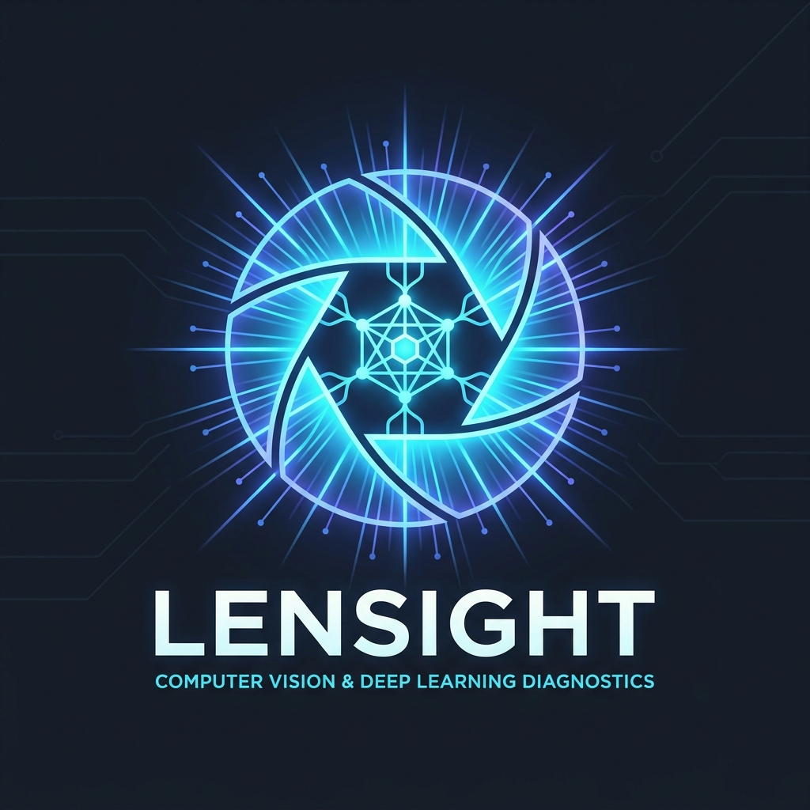
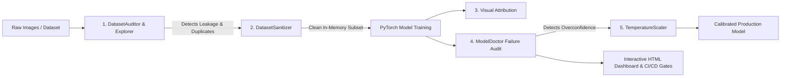

<div align="center">



# 🔍 lensight

**The unified, production-grade PyTorch computer-vision diagnostic, interpretability, and dataset health toolkit.**

[](https://pypi.org/project/lensight/)
[](https://www.python.org/downloads/)
[](LICENSE)
[](tests/)
[](pyproject.toml)
[](https://github.com/csharikrishna/Lensight)

[Why Lensight?](#-why-lensight-vs-the-fragmented-stack) •
[Installation](#-installation) •
[Quickstart](#-quickstart-cheat-sheet) •
[Core Workflows](#-the-5-core-workflows) •
[CLI](#-command-line-interface-cli) •
[Architecture](docs/ARCHITECTURE.md) •
[Benchmarks](docs/BENCHMARKS_AND_OPTIMIZATIONS.md) •
[API Reference](docs/API.md) •
[Use Cases](docs/USECASES.md) •
[Launch Kit](docs/GITHUB_LAUNCH_KIT.md)

</div>

---

## 💡 Why Lensight? (vs. The Fragmented Stack)

Building production computer vision isn't just about training loss. Practitioners face critical engineering questions across the entire model lifecycle:
* *Are train/test splits contaminated by leaked near-duplicates?*
* *Is my training set poisoned by contradictory cross-label duplicates or blur?*
* *Where is my model actually looking, and why did it predict Class A instead of runner-up Class B?*
* *Why did it fail on a batch of images? Are mistakes random noise or systematic blind spots?*
* *Can downstream thresholding trust the model's confidence scores, or is it severely overconfident?*

Previously, teams had to stitch together **5 to 6 separate, conflicting libraries** with heavy dependencies. **`lensight` unifies the entire computer vision diagnostic lifecycle into a single, clean, zero-bloat toolkit:**

| CV Diagnostic Need | Legacy Fragmented Stack | **`lensight` Unified Approach** |
|---|---|---|
| **Visual Attribution & CAM** | `pytorch-grad-cam` + `captum` | `GradCAM`, `HiResCAM`, `ContrastiveCAM`, `IntegratedGradients` (CNN & ViT native, vectorized GPU batching) |
| **Dataset Health & Vision EDA** | Ad-hoc scripts / `pandas-profiling` | `DatasetExplorer` (Laplacian sharpness, exposure clipping, class balance) |
| **Duplicates & Leakage Auditing** | `imgcheck` / `imgdedup` (disk-only, slow loops) | `DatasetAuditor` ($50\times$ faster vectorized NumPy bitwise hashing, transitive Union-Find) |
| **Label Noise & Quality Audit** | `cleanlab` | Built directly into `ModelDoctor.diagnose()` via high-confidence contradiction discovery |
| **Confidence Calibration** | `netcal` | `TemperatureScaler` (1-line post-hoc optimization, zero top-1 accuracy change) |
| **Dataset Sanitization** | Destructive deletion scripts | `DatasetSanitizer` (in-memory `torch.utils.data.Subset` with zero disk mutation) |
| **Interactive Dashboards** | Custom notebook plotting code | Self-contained, zero-dependency dark-mode HTML dashboards & notebook-native `_repr_html_()` |

---

## 🔄 The Complete Lifecycle Architecture



---

## ⚡ Installation

Install from local checkout:
```bash
git clone https://github.com/csharikrishna/Lensight.git
cd Lensight
pip install -e .
```

Or install dependencies directly:
```bash
pip install torch numpy pillow scikit-learn
```

> **Zero Heavy Bloat**: `lensight` does **not** force installations of OpenCV, Pandas, or heavy PDF generators. All perceptual hashing, blur variance, and interactive dashboards use pure NumPy, PyTorch, and Pillow.

---

## 🚀 Quickstart Cheat Sheet

Never leave your terminal or Python session! You can print the built-in quick reference anytime:

```python
import lensight
lensight.help()
```

Or from your command line:
```bash
lensight help
```

---

## 🛠️ The 5 Core Workflows

### 1. Visual Attribution: Explain Any Prediction
Understand *why* a model made a decision and *what* differentiated it from a competitor class.

```python
import torch
from PIL import Image
from lensight import GradCAM, HiResCAM, ContrastiveCAM
from lensight.utils.image_utils import denormalize, overlay_heatmap

model.eval()

# 1. Classic Grad-CAM (auto-detects target layer)
cam = GradCAM(model)
heatmap = cam.explain(image_tensor)  # Explains argmax prediction
rgb = denormalize(image_tensor)
overlay = overlay_heatmap(rgb, heatmap)
Image.fromarray(overlay).save("reports/gradcam.png")

# 2. HiResCAM (NeurIPS 2020: pixel-level gradients without spatial pooling wash-out)
hires = HiResCAM(model)
hires_map = hires.explain(image_tensor)

# 3. Contrastive CAM ("Why target class A instead of runner-up class B?")
contrastive = ContrastiveCAM(model)
contrast_map = contrastive.explain(image_tensor, target_class=cat_idx, contrast_class=dog_idx)
```

#### Explaining Vision Transformers (ViT, DeiT, DINO)
```python
from lensight import GradCAM, create_vit_reshape_transform

vit_cam = GradCAM(
    vit_model,
    target_layer=vit_model.blocks[-1].norm1,
    reshape_transform=create_vit_reshape_transform(has_cls_token=True),
)
heatmap = vit_cam.explain(image_tensor)
```

---

### 2. Pre-Training Dataset Health & EDA
Audit your computer vision dataset for the 5 fatal defects before launching training.

```python
from lensight import DatasetExplorer

explorer = DatasetExplorer(class_names=CLASS_NAMES)
report = explorer.analyze(train_loader)

# Print terminal diagnostic breakdown
print(report.summary_text())

# Export standalone interactive HTML dashboard
report.save_html("reports/eda_report.html")

# In Jupyter / Colab, simply render inline:
report
```
* **Class Imbalance**: Flags long-tail ratios ($N_{\text{max}} / N_{\text{min}}$) with Gini coefficients.
* **Exposure & Contrast**: Flags underexposed (dark clipping) and overexposed (blown highlights) samples.
* **Laplacian Sharpness**: $3 \times 3$ Laplacian filter variance flags degraded, out-of-focus, or motion-blurred inputs.
* **Perceptual Duplicates**: 64-bit difference hashing (`dhash`) catches redundant samples.

---

### 3. Data Leakage, Duplicate Clusters & In-Memory Sanitization
Detect train/test data contamination and contradictory cross-label duplicates, then sanitize without modifying disk files.

```python
from lensight import DatasetAuditor, check_leakage, DatasetSanitizer

# A. Deep Audit: Transitive duplicate clusters & cross-label conflicts
auditor = DatasetAuditor(class_names=CLASS_NAMES)
audit_report = auditor.audit(raw_dataset, threshold=0)
print(audit_report.summary_text())
audit_report.save_html("reports/audit_report.html")

# B. Train/Test Leakage: Check if validation images leaked into training set
leak_report = check_leakage(train_loader, test_loader, threshold=0)
print(f"Leaked validation samples: {leak_report.leaked_count} ({leak_report.leakage_rate * 100:.1f}%)")

# C. Non-Destructive In-Memory Sanitization (zero disk mutation!)
# Returns a clean torch.utils.data.Subset with all duplicate contamination removed:
clean_train_dataset = DatasetSanitizer.clean_subset(raw_dataset, audit_report)

# D. Or safely export clean files to disk (mirroring class subfolders):
DatasetSanitizer.export_clean_directory("data/raw_images", "data/clean_images", audit_report)
```

---

### 4. End-to-End Model Failure Diagnosis (`ModelDoctor`)
Audit thousands of validation predictions in a single call. Automatically clusters failure modes using embedding representations and flags annotation noise.

```python
from lensight import ModelDoctor

doctor = ModelDoctor(model, class_names=CLASS_NAMES)
report = doctor.diagnose(
    val_loader,
    n_clusters=4,
    include_eda=True,  # Combines failure analysis with dataset health
    report_title="ResNet-18 Production Health Audit",
)

# 1. Review failure summary in terminal
print(report.summary_text())

# 2. Save self-contained interactive dashboard (open in any browser)
report.save_html("reports/diagnosis_report.html")

# 3. High-confidence dataset annotation mistakes:
suspected_label_errors = report.misclassification.find_label_errors(min_confidence=0.80)
print(f"Found {len(suspected_label_errors)} contaminated dataset annotations.")
```

---

### 5. One-Line Confidence Calibration (`TemperatureScaler`)
Fix overconfident predictions and miscalibration without retraining and **without changing top-1 accuracy**.

```python
from lensight import TemperatureScaler

# Fit optimal temperature scalar T on validation logits via NLL loss
scaler = TemperatureScaler(model)
summary = scaler.fit(val_loader)

print(f"Initial ECE:    {summary.initial_ece:.4f}")
print(f"Calibrated ECE: {summary.calibrated_ece:.4f}  (Temperature T = {summary.temperature:.2f})")

# Drop-in nn.Module ready for production serving:
calibrated_model = scaler.calibrated_model
probs = calibrated_model.predict_proba(image_tensor)  # Properly calibrated probabilities!
```

---

## 💻 Command Line Interface (CLI)

`lensight` includes a fast, zero-configuration CLI:

```bash
# 1. Audit an image dataset folder for duplicates, corrupt files, and imbalance:
lensight audit --dataset data/my_dataset/ --report reports/audit_report.html

# 2. Check for train/test data leakage across split folders:
lensight leakage --train data/train/ --test data/val/

# 3. Sanitize a dataset by copying only clean survivors to a new directory:
lensight clean --dataset data/my_dataset/ --output data/clean_dataset/

# 4. View environment and GPU status:
lensight info

# 5. Interactive quick reference:
lensight help
```

---

## 🛡️ Automated CI/CD Quality Gates & MLOps

Export structured telemetry to enforce quality gates in GitHub Actions, GitLab CI, Weights & Biases, or MLflow:

```python
# In your CI evaluation pipeline:
report = doctor.diagnose(val_loader)
report.to_json("reports/diagnosis_metrics.json")
metrics = report.to_dict()

# Automated Production Deployment Quality Gates:
assert metrics["misclassification"]["accuracy"] >= 0.85, "Accuracy regression!"
assert metrics["calibration"]["ece"] <= 0.08, "Miscalibration exceeds safety tolerance!"
assert len(metrics["misclassification"]["suspected_label_errors"]) <= 10, "Dataset noise too high!"
print("[OK] Model passed all production criteria.")
```

---

## 📊 Complete API Overview

| Module | Primary Symbol | Description |
|---|---|---|
| `lensight` | `GradCAM` | Gradient-weighted class activation mapping (single & batched GPU) |
| `lensight` | `HiResCAM` | Elementwise gradient weighting without spatial pooling (NeurIPS 2020) |
| `lensight` | `ContrastiveCAM` | Contrastive attribution: *Why target class over comparator class?* |
| `lensight` | `EigenCAM` | Gradient-free attribution via first principal component (SVD) |
| `lensight` | `IntegratedGradients` | Path-integrated attribution satisfying completeness axiom |
| `lensight` | `ModelDoctor` | Automated failure clustering, label noise detection, and HTML reporting |
| `lensight` | `TemperatureScaler` | Learned temperature scaling probability calibration (ICML 2017) |
| `lensight` | `DatasetExplorer` | Pre-training CV dataset health check (imbalance, blur, exposure) |
| `lensight` | `DatasetAuditor` | Multi-split deep audit: Transitive duplicate clusters & leakage detection |
| `lensight` | `DatasetSanitizer` | Non-destructive in-memory `Subset` sanitization & directory cleaner |
| `lensight` | `create_vit_reshape_transform` | Reshape adapter for Vision Transformers (ViT, DeiT, DINO) |
| `lensight` | `help()` | Interactive quick-reference cheat sheet |

---

## 🧪 Running the Test Suite

```bash
pytest
```
The test suite contains **44 comprehensive unit tests** covering explainers, failure clustering, temperature scaling, perceptual hashing, leakage detection, and dataset sanitization. The entire suite runs in **~6 to 8 seconds** with zero external network access and zero GPU requirements.

---

## 📚 Real-World Playbooks & Documentation

* **[Real-World Engineering Guide & 8 Use Cases](docs/USECASES.md)**: In-depth production playbooks with actual benchmarks from a ResNet-18 model trained on Fashion-MNIST.
* **[Complete API Reference](docs/API.md)**: Full parameter signatures and return types for every module.
* **[Artifacts & Reports Catalog](reports/README.md)**: Guide to all generated HTML dashboards, JSON manifests, and visual overlays.

---

## 🤝 Contributing & License

Contributions, bug reports, and feature suggestions are warmly welcomed! Feel free to open an issue or pull request on GitHub.

Released under the [MIT License](LICENSE).
